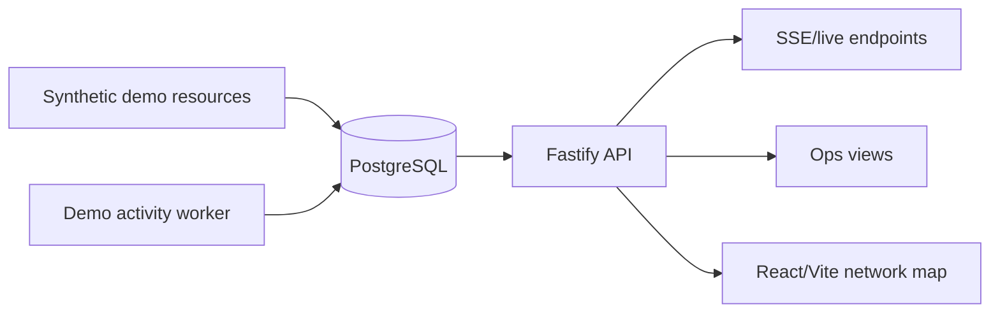

# AgentsMap Runtime

**Source-available portfolio demo** for real-time observability of economic activity between agents, services and programmable payment surfaces.

This repository demonstrates the architecture of AgentsMap without publishing the production runtime. It keeps the product shape —PostgreSQL data model, Fastify API, live endpoints, SSE surfaces, operational views and React/Vite network map— while replacing external discovery/indexing workers with a synthetic local demo worker.

The goal is to show end-to-end backend/data/product engineering without exposing production deployment details, private datasets, discovery strategy, crawling logic or production worker code.

---

## What this demonstrates

- End-to-end TypeScript system architecture
- Fastify API with live data views and operational endpoints
- PostgreSQL schema design and SQL migrations
- Synthetic demo data and local event generation
- Server-sent events for real-time update surfaces
- React/Vite network visualization for agent/payment activity
- Local operation with Docker Compose, migrations and seed data
- Product/system thinking around observability, attribution and map projection

---

## What is intentionally excluded

This public portfolio version does **not** include the production core of AgentsMap:

- no production deployment scripts;
- no private server configuration;
- no raw datasets or research dumps;
- no production RPC/discovery credentials;
- no real crawling or external discovery strategy;
- no production on-chain indexing worker;
- no production correlation/classification worker logic.

Instead, the repo includes a synthetic worker that generates local demo payment activity from safe seed data.

---

## Architecture



### Main components

- `apps/api` — Fastify API, live endpoints, ops views and SSE streams.
- `apps/web` — React/Vite interactive network map.
- `apps/worker` — synthetic demo activity worker only.
- `packages/db` — PostgreSQL client and migrations.
- `packages/shared` — shared normalization and payment-signal utilities.
- `scripts` — local dev, migrations and demo seeding helpers.

---

## Quick start

### 1. Install dependencies

```bash
npm install
```

### 2. Configure environment

```bash
cp .env.example .env
```

### 3. Start PostgreSQL

```bash
npm run db:up
```

### 4. Run migrations

```bash
npm run db:migrate
```

### 5. Seed demo resources

```bash
npm run seed:demo
```

### 6. Start API, web UI and synthetic worker

Run each command in a separate terminal:

```bash
npm run dev:api
npm run dev:web
npm run dev:worker
```

Or start the local demo stack:

```bash
npm run dev:stack
npm run dev:stack:status
npm run dev:stack:stop
```

Open:

- Web map: `http://localhost:5173`
- API health: `http://localhost:8080/health`
- Ops map: `http://localhost:8080/ops/map/view`

---

## Demo data flow

The portfolio version uses this safe local flow:

1. `data/demo/rows-demo.tsv` defines synthetic sellers, resources and payTo addresses.
2. `npm run seed:demo` loads those resources into PostgreSQL.
3. `npm run dev:worker` inserts synthetic payment events against those demo resources.
4. The API exposes live activity, registry data and map-ready endpoints.
5. The frontend visualizes the activity as an interactive network.

No external RPC, registry, crawler or production service is required for the demo.

---

## Key API surfaces

- `GET /health`
- `GET /live/feed?limit=200`
- `GET /live/nodes?window=5m|1h|24h`
- `GET /live/edges?window=5m|1h|24h`
- `GET /live/stream?sinceId=0`
- `GET /map/islands`
- `GET /registry/sellers`
- `GET /registry/resources`
- `GET /ops/map/view`
- `GET /ops/activity/view`

---

## Portfolio framing

This repository is designed to show how an AI/backend/data product can become an operational system:

1. model external resources and payment surfaces;
2. normalize and persist activity signals;
3. expose useful APIs and live streams;
4. visualize activity as a network map;
5. keep the runtime understandable and maintainable.

The interesting part is the system boundary: data model, attribution surfaces, API design, live updates, product-facing visualization and operational ergonomics.

---

## Documentation

- [`docs/ARCHITECTURE.md`](docs/ARCHITECTURE.md)
- [`docs/DATA_PIPELINE.md`](docs/DATA_PIPELINE.md)
- [`docs/CASE_STUDY.md`](docs/CASE_STUDY.md)
- [`docs/SETUP.md`](docs/SETUP.md)
- [`docs/PUBLICATION_CHECKLIST.md`](docs/PUBLICATION_CHECKLIST.md)

---

## Status

Portfolio/demo version. The production runtime is not included.

## License

Source-available portfolio license. This repository is provided for review and evaluation only, not for commercial reuse or production deployment.
