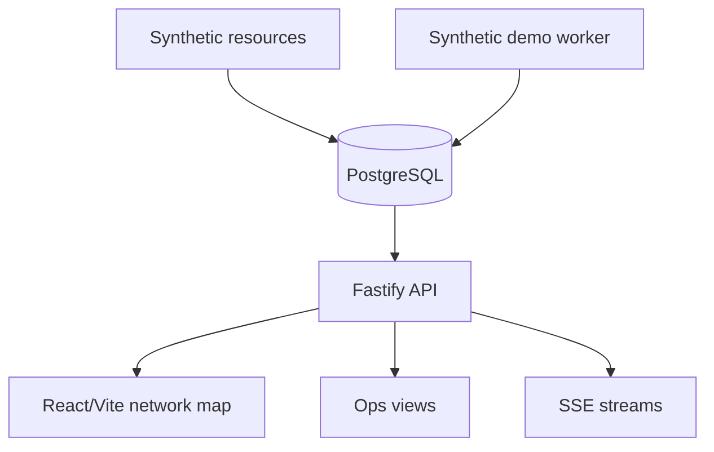

# Architecture

AgentsMap Runtime is built around one idea: agent economic activity becomes useful when it is normalized, persisted and visualized as an operational graph.

This public repository is a source-available demo version. It keeps the API, database and visualization shape, but replaces production ingestion/discovery workers with synthetic local activity.

## Component map

## Backend API

`apps/api/src/server.ts` exposes the runtime through three groups of endpoints:

- public/live surfaces for map data, feed data and SSE streams;
- registry endpoints for sellers, resources and payTo attribution;
- operational views that make the runtime easy to inspect.

## Demo worker model

The public demo includes one worker entrypoint:

- `apps/worker/src/demo_activity_worker.ts`

It reads local synthetic resources and inserts demo payment events. It does not call external RPC providers, discovery registries or production services.

## Data model

The database is migration-driven. It stores sellers, resources, attribution records, synthetic payment events and derived map/activity views.

## Frontend

The web app uses React, Vite and Three.js to render agent/payment activity as a dynamic network map.

## Excluded from this portfolio version

Production discovery, crawling, on-chain indexing, correlation heuristics, deployment topology and private datasets are intentionally not included.
